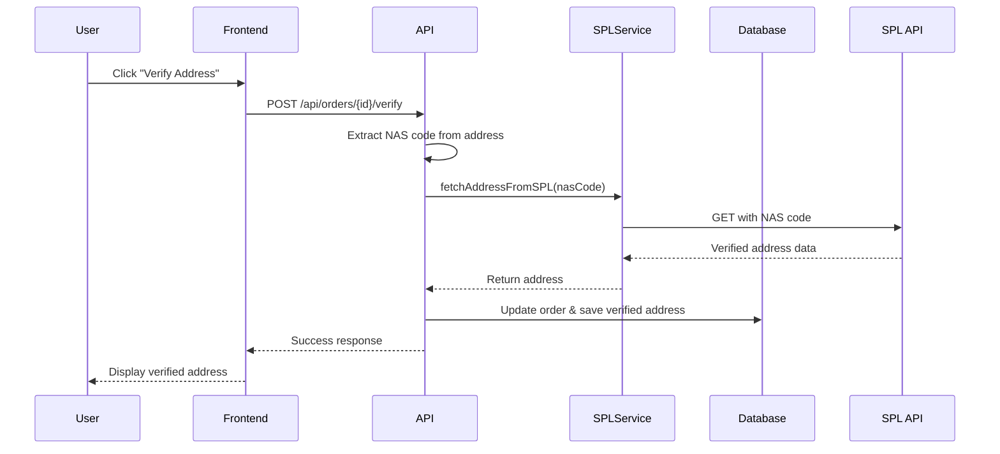
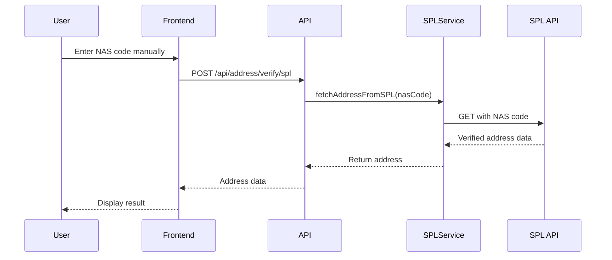

# SPL NAD (Saudi Post National Address) Verification System

## Overview

The SPL NAD verification system is a critical component of SaylogixOS that validates and enriches delivery addresses using the official Saudi Post National Address API. This system ensures accurate address data for efficient logistics operations and successful deliveries in Saudi Arabia.

## Architecture

### System Components

1. **SPL Service Module** (`server/services/splService.ts`)
   - Core API integration with Saudi Post
   - Request/response logging and error handling
   - NAS code validation and extraction

2. **API Routes** (`server/routes.ts`)
   - Multiple endpoints for verification workflows
   - Order-based and standalone verification support
   - Batch processing capabilities

3. **Storage Layer** (`server/storage.ts`)
   - Verified addresses persistence
   - Verification attempts tracking
   - Order address updates

4. **Frontend Components** (`client/src/pages/AddressVerify.tsx`)
   - Interactive verification interface
   - Real-time verification status
   - Address preview and editing

## NAS Code Format

### Structure
- **Format**: `ABCD1234` (8 characters total)
- **Pattern**: 4 uppercase letters + 4 digits
- **Example**: `RIYD2342`, `JEDD5678`, `RESB3139`

### Validation
```typescript
const NAS_REGEX = /^[A-Z]{4}\d{4}$/i;
```

## API Integration Details

### Endpoint
```
Base URL: http://apina.address.gov.sa/NationalAddress/NationalAddressByShortAddress
Method: GET
```

### Request Parameters
```
?format=json
&language=en
&encode=utf8
&shortaddress={NAS_CODE}
&api_key={SPL_API_KEY}
```

### Authentication
- **Method**: Query parameter or HTTP header
- **Key Name**: `api_key`
- **Environment Variable**: `SPL_API_KEY`

### Response Format
```json
{
  "Address": "Full address string",
  "PostCode": "12345",
  "AdditionalNumber": "6789",
  "Latitude": "24.7136",
  "Longitude": "46.6753",
  "City": "Riyadh",
  "District": "Al Olaya",
  "Street": "King Fahd Road",
  "BuildingNumber": "2342"
}
```

## Verification Flow

### 1. Order-Based Verification



### 2. Manual Verification



## Data Processing Logic

### 1. NAS Code Extraction
```typescript
function extractNASFromAddress(address: string): string | null {
  if (!address) return null;
  
  // RegEx to find 8-character NAS codes (4 letters + 4 digits)
  const NAS_REGEX = /\b[A-Z]{4}\d{4}\b/i;
  const match = address.match(NAS_REGEX);
  
  return match ? match[0].toUpperCase() : null;
}
```

### 2. Address Field Mapping
The system handles multiple response formats from the SPL API:

```typescript
const result = {
  shortCode: shortcode.toUpperCase(),
  fullAddress: data.Address || data.FullAddress || data.address || data.fullAddress,
  postalCode: data.PostCode || data.PostalCode || data.postCode || data.postalCode,
  additionalCode: data.AdditionalNumber || data.AdditionalCode,
  coordinates: {
    lat: parseFloat(data.Latitude || data.latitude || data.lat),
    lng: parseFloat(data.Longitude || data.longitude || data.lng)
  },
  city: data.City || data.city,
  district: data.District || data.district,
  street: data.Street || data.street,
  buildingNumber: data.BuildingNumber || data.buildingNumber
};
```

### 3. Verification Tracking
Each verification attempt is logged with:
- Timestamp
- Method (SPL_API, manual, WhatsApp)
- Success/failure status
- Response data or error message
- Duration in milliseconds

## Error Handling

### API Error Responses

| Status Code | Meaning | System Response |
|------------|---------|-----------------|
| 401 | Authentication failed | "Saudi Post API authentication failed. Please check your API key." |
| 404 | NAS code not found | "NAS code not found in Saudi Post database." |
| 500 | Server error | "Saudi Post API server error. Please try again later." |

### Error Prevention
- **No Mock Data**: System never returns fake addresses
- **Clear Error Messages**: Users see specific error reasons
- **Validation First**: NAS format checked before API call
- **Comprehensive Logging**: All requests logged for debugging

## Database Schema

### Verified Addresses Table
```sql
verifiedAddresses:
  - nasCode (primary key)
  - fullAddress
  - postalCode
  - additionalCode
  - latitude
  - longitude
  - city
  - district
  - street
  - buildingNumber
  - createdAt
  - updatedAt
```

### Address Verifications Table
```sql
addressVerifications:
  - orderId (foreign key)
  - originalAddress
  - verifiedAddress
  - status (pending/verified/failed)
  - verificationMethod
  - verificationAttempts (JSON)
  - nasCode
  - latitude
  - longitude
  - verifiedAt
```

## Security Considerations

1. **API Key Protection**
   - Stored as environment variable
   - Never exposed in logs (replaced with "REDACTED")
   - Required for all verification attempts

2. **Request Validation**
   - NAS format validated before API call
   - Input sanitization for SQL injection prevention
   - Rate limiting considerations

3. **Data Privacy**
   - Full request/response logging for audit trail
   - Sensitive data handling compliance
   - User consent for address updates

## Performance Optimization

1. **Caching Strategy**
   - Verified addresses stored in database
   - Reuse previous verifications for same NAS code
   - Reduces API calls and improves response time

2. **Batch Processing**
   - Endpoint for multiple NAS codes: `/api/address/verify/spl/batch`
   - Efficient for bulk order processing
   - Parallel request handling

3. **Timeout Handling**
   - 30-second timeout for API requests
   - Graceful failure with clear error messages
   - Retry logic for transient failures

## Frontend Integration

### Verification UI Components

1. **Order Verification Tab**
   - Lists orders with unverified addresses
   - Click-to-verify functionality
   - Real-time status updates

2. **Manual Verification Tab**
   - Direct NAS code input
   - Format validation
   - Instant results display

3. **Verified Database Tab**
   - Historical verification records
   - Search and filter capabilities
   - Export functionality

### User Experience Features

1. **Visual Feedback**
   - Loading states during verification
   - Success/error notifications
   - Progress indicators

2. **Address Preview**
   - Before/after comparison
   - Field-by-field display
   - GPS coordinates with map integration

3. **Action Buttons**
   - One-click verification
   - Update order address
   - Copy verified address

## Event Logging

### Event Types
- `EV015`: Address verified successfully
- `EV016`: Address verification failed

### Event Data Structure
```json
{
  "eventId": "EV015-1234567890",
  "eventType": "address_verified",
  "entityType": "order",
  "entityId": 123,
  "description": "Address verified via SPL API for NAS: RIYD2342",
  "status": "success",
  "triggeredBy": "verification_system",
  "sourceSystem": "SPL_API",
  "eventData": { ...verifiedAddress }
}
```

## Testing and Quality Assurance

### Unit Testing Scenarios
1. Valid NAS code format validation
2. Invalid NAS code rejection
3. API response parsing
4. Error handling paths
5. Database update verification

### Integration Testing
1. End-to-end verification flow
2. API authentication
3. Database persistence
4. Frontend updates
5. Event emission

### Manual Testing Checklist
- [ ] Verify order with valid NAS code
- [ ] Test invalid NAS format rejection
- [ ] Confirm error message display
- [ ] Check database updates
- [ ] Validate frontend state changes
- [ ] Test batch verification
- [ ] Verify event logging

## Troubleshooting Guide

### Common Issues

1. **401 Authentication Error**
   - Check SPL_API_KEY environment variable
   - Verify API key validity with Saudi Post
   - Ensure key format is correct

2. **404 NAS Not Found**
   - Confirm NAS code format (ABCD1234)
   - Verify code exists in Saudi Post system
   - Check for typos or case sensitivity

3. **Timeout Errors**
   - Check network connectivity
   - Verify Saudi Post API status
   - Consider implementing retry logic

### Debug Information
All API requests include comprehensive logging:
- Request timestamp
- URL (with redacted API key)
- Request headers
- Response status and headers
- Response body (first 1000 chars)
- Error details
- Total duration

## Future Enhancements

1. **Fallback Mechanisms**
   - WhatsApp verification for failed SPL lookups
   - Manual address entry with validation
   - Third-party address APIs integration

2. **Advanced Features**
   - Address autocomplete
   - Bulk import/export
   - Address quality scoring
   - Delivery success correlation

3. **Performance Improvements**
   - Redis caching layer
   - Request queuing
   - Webhook-based updates
   - Predictive verification

## Compliance and Standards

1. **Saudi Post Requirements**
   - Adherence to API usage policies
   - Proper attribution
   - Rate limit compliance
   - Data accuracy standards

2. **Data Protection**
   - GDPR compliance for international orders
   - Local data residency requirements
   - Encryption in transit and at rest
   - Access control and audit logs

## Conclusion

The SPL NAD verification system is a robust, production-ready solution that ensures accurate address data for logistics operations in Saudi Arabia. By integrating directly with the official Saudi Post API, the system provides reliable, real-time address verification while maintaining data integrity and security standards.

### Key Benefits
- **Accuracy**: Direct integration with official source
- **Reliability**: Comprehensive error handling
- **Performance**: Optimized with caching and batch processing
- **Security**: Protected API access and data handling
- **Usability**: Intuitive interface with clear feedback

For technical support or API access, contact the Saudi Post technical team or refer to the official API documentation.